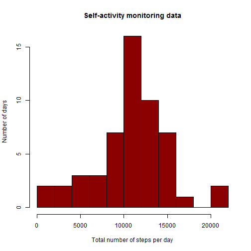
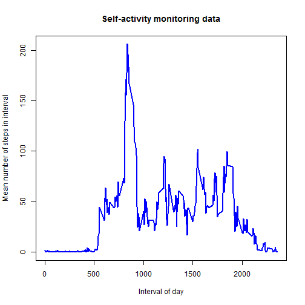
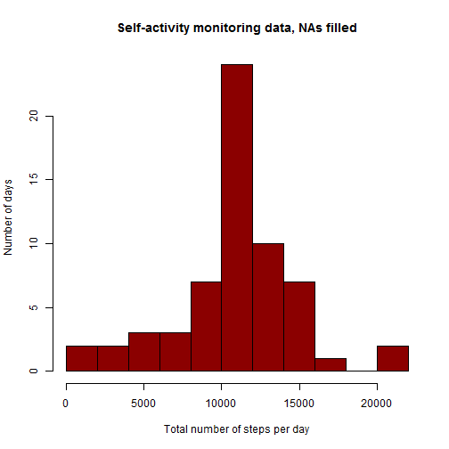
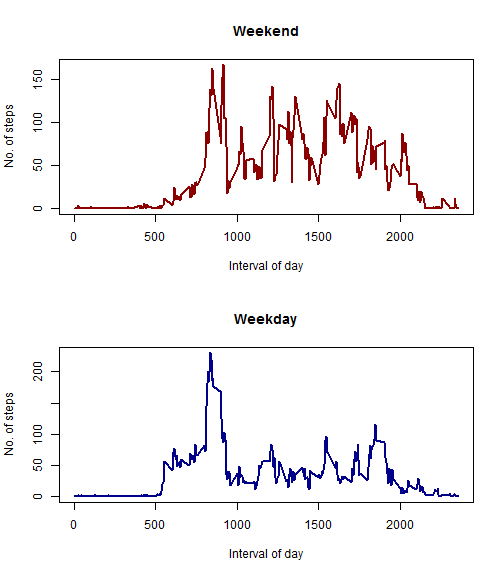

Reproducible Research / Peer Assessment 1 / June 2014
=====================================================

This project analyzes data obtained from personal health monitoring devices. 
The particular dataset provided for the project stores the number of steps taken 
within five-minute intervals over 61 days.  

## Loading and preprocessing the data
The original data is stored in the "actdata_original" dataframe.  


```r
actdata_original <- read.csv("activity.csv")
```


## What is mean total number of steps taken per day?
Here we first plot a histogram of the total number of steps taken per day.  
The summation did not take into account NA values, and therefore the data 
frame created here with the sums includes 8 NA values.  The mean and median
calculations have to disregard these.


```r
library(data.table)
act_DT <- data.table(actdata_original)
sumact_DT <- act_DT[, lapply(.SD, sum(na.rm = TRUE)), by = date, .SDcols = c("steps")]

hist(sumact_DT$steps, main = "Self-activity monitoring data", xlab = "Total number of steps per day", 
    ylab = "Number of days", breaks = 10, col = "darkred")
```

 


```r
meanstepsperday <- mean(sumact_DT$steps, na.rm = TRUE)
medianstepsperday <- median(sumact_DT$steps, na.rm = TRUE)
```

  
  
**The mean steps per day is 1.0766 &times; 10<sup>4</sup>. 
The median steps per day is 10765.**
  
  

## What is the average daily activity pattern?
In this section we calculate the average numbers of steps taken within 
each of the intervals, averaged over all days for which there is data.  
This is plotted vs. the interval.


```r
actdata <- actdata_original
intlist <- unique(actdata$interval)

# Calculate the means and plot:
intmeans <- sapply(intlist, function(int) mean(actdata$steps[actdata$interval == 
    int], na.rm = TRUE))

plot(intlist, intmeans, type = "l", xlab = "Interval of day", ylab = "Mean number of steps in interval", 
    lwd = 2, col = "blue", main = "Self-activity monitoring data")
```

 

```r

# Find and note the position of the interval with max. no. of steps
maxinterval <- intlist[intmeans == max(intmeans)]
maxintervalposition <- match(max(intmeans), intmeans)
```

  
  
  **The interval numbered 835 has the greatest average number of 
steps across days.  It is in position number 104 among the intervals.**
  
    

## Imputing missing values

Some exploratory data analysis showed that there are 2304 NA values in the steps data, and that furthermore, steps data is always missing in chunks of one full day (i.e. there are 8 days for which there is no data and all the rest of the days have data for every interval).  The calculation of the variable **NAsperday** in the following code chunk has this purpose.  

To replace data on the missing days, I fill in each missing interval with the average calculated in the previous section for that interval in all the days for which this data exists.  I use **NAsperday** to detect which days should have their values replaced.  This does mean that all the days with missing data get the same values for the same interval, but this is meant to be a simple strategy... The new dataset with filled-in data is called **actdata_filled**.   


```r
actdata$daynumber <- as.numeric(actdata_original$date)
daylist <- unique(actdata$daynumber)

NAsperday <- sapply(daylist, function(day) sum(is.na(actdata$steps[actdata$daynumber == 
    day])))

actdata_filled <- actdata_original

for (thisday in daylist) {
    if (NAsperday[thisday] != 0) {
        actdata_filled$steps[actdata$daynumber == thisday] <- intmeans
    }
}
```


Repeating the histogram and mean/median calculations from the earlier section:


```r
act_DT <- data.table(actdata_filled)
sumactfilled_DT <- act_DT[, lapply(.SD, sum(na.rm = TRUE)), by = date, .SDcols = c("steps")]

hist(sumactfilled_DT$steps, main = "Self-activity monitoring data, NAs filled", 
    xlab = "Total number of steps per day", ylab = "Number of days", breaks = 10, 
    col = "darkred")
```

 


```r
meanstepsperday_filled <- mean(sumactfilled_DT$steps, na.rm = TRUE)
medianstepsperday_filled <- median(sumactfilled_DT$steps, na.rm = TRUE)

percentmeandiff <- 100 * abs(meanstepsperday - meanstepsperday_filled)/meanstepsperday
percentmediandiff <- 100 * abs(medianstepsperday - medianstepsperday_filled)/medianstepsperday
```


With the missing data filled in, the mean steps per data is 
1.0766 &times; 10<sup>4</sup>, whereas it was 1.0766 &times; 10<sup>4</sup> 
without the missing data.  The percent change is 0 %.  

With the missing data filled in, the median steps per data is
1.0766 &times; 10<sup>4</sup>, whereas it was 10765
without the missing data.  The percent change is 0.011 %.  


**Because the method used to fill in the data for the days for which data was missing uses the mean values calculated previously while ignoring the missing data, the average total number of steps per day does not change at all with this method.**


## Are there differences in activity patterns between weekdays and weekends?

To ascertain the answer to this question we first have to convert the **date** column of the activity data to the Date format, then create a classifier factor variable **dayclass**, populated by "weekday" or "weekend" levels according to the day of the week.


```r

actdata_filled$date <- as.Date(actdata_filled$date)
actdata_filled$DayofWeek <- weekdays(actdata_filled$date)
actdata_filled$daynumber <- actdata$daynumber

# First fill with 'weekday', then correct Saturdays and Sundays
dayclass <- rep.int("weekday", length(actdata_filled$daynumber))
dayclass[actdata_filled$DayofWeek == "Saturday"] <- "weekend"
dayclass[actdata_filled$DayofWeek == "Sunday"] <- "weekend"
actdata_filled$dayclass <- as.factor(dayclass)
```


Here, the Saturday and Sunday corrections were done on separate lines for better readability.   We continue with a plot, first subsetting the data frame and taking the averages over weekdays only and weekends only:


```r

actdata_weekdays <- subset(actdata_filled, dayclass == "weekday")
actdata_weekends <- subset(actdata_filled, dayclass == "weekend")

intmeans_weekdays <- sapply(intlist, function(int) mean(actdata_weekdays$steps[actdata$interval == 
    int], na.rm = TRUE))
intmeans_weekends <- sapply(intlist, function(int) mean(actdata_weekends$steps[actdata$interval == 
    int], na.rm = TRUE))

par(mfrow = c(2, 1))

plot(intlist, intmeans_weekends, type = "l", col = "red4", lwd = 2, main = "Weekend", 
    ylab = "No. of steps", xlab = "Interval of day")
plot(intlist, intmeans_weekdays, type = "l", col = "blue4", lwd = 2, main = "Weekday", 
    ylab = "No. of steps", xlab = "Interval of day")
```

 


At-a-glance observations:  

* Weekend action is more chaotic and spaced more evenly during the day.
* Weekday peak activity is higher than weekend peak activity.
* This person moved faster (have more steps-per-five-minutes) in their morning commute.

